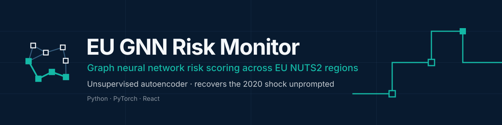
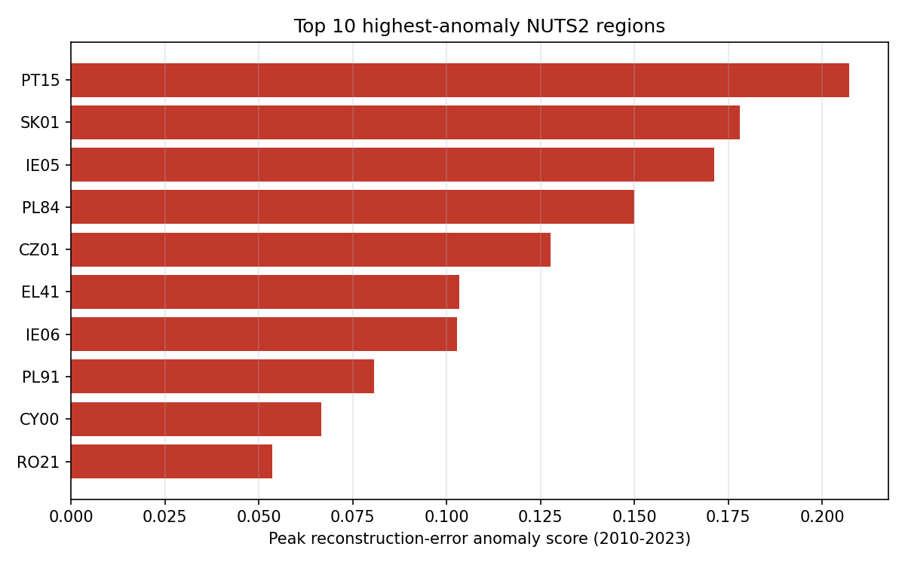
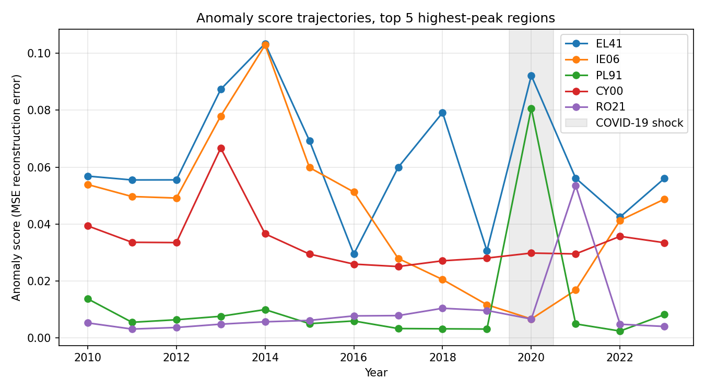
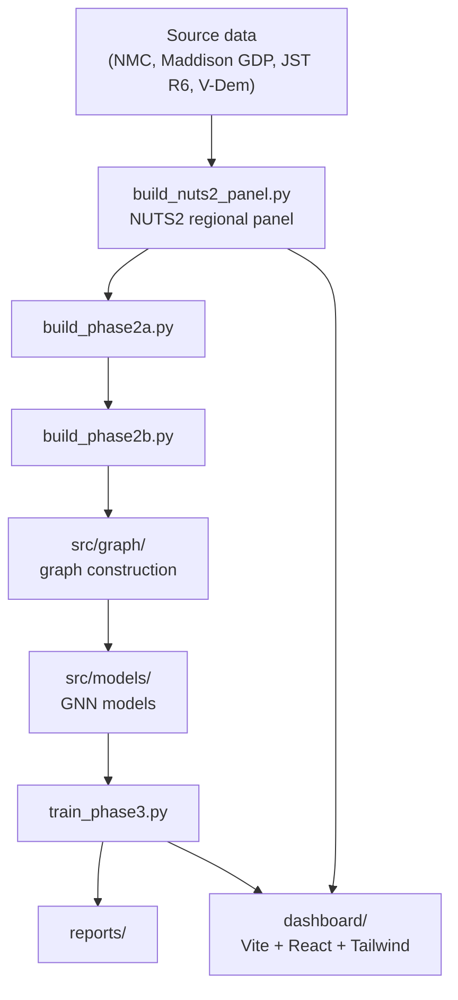

<p align="center">
  
</p>

A graph neural network pipeline for monitoring economic/political risk across EU NUTS2 regions, built on a harmonized regional panel and a country-code bridge table (COW `stateabb` as canonical identifier).

📖 **[Full methodology, architecture, and face-validity checks → project Wiki](https://github.com/andrm101/eu-gnn-risk-monitor/wiki)**

## Results at a glance

<p align="center">
  
  
</p>

Two of the top 5 highest-anomaly region-years peak in 2020 (COVID-19 shock) — the unsupervised model recovers a known macro shock without being told when it occurred. See the [wiki](https://github.com/andrm101/eu-gnn-risk-monitor/wiki) for the full face-validity writeup.

## Status

Phase 1 (Data Foundation) is complete: regional panel construction, source ingestion (NMC v7, Maddison GDP, JST R6 loans/investment), and country code harmonization are in place. Phase 2 (graph construction, `src/graph/`) and Phase 3 (GNN autoencoder training, `src/models/`) have working implementations and a trained checkpoint (`data/processed/gnn_model.pt`) and risk scores (`data/processed/nuts2_risk_scores.parquet`) already exist locally, though `data/processed/` is gitignored (generated artifacts), so a fresh clone must regenerate them — see "Running it" below.

## Architecture



## Pipeline stages

| Stage | Script | Purpose |
|---|---|---|
| Panel build | `build_nuts2_panel.py` | Constructs the harmonized NUTS2 regional panel |
| Phase 2a | `build_phase2a.py` | Intermediate feature/graph build step |
| Phase 2b | `build_phase2b.py` | Second intermediate build step |
| Training | `train_phase3.py` | GNN model training |

## Running it

Stages must run in order — each writes inputs the next stage requires under `data/processed/` (gitignored, so this must be re-run after a fresh clone):

```bash
conda env create -f environment.yml
conda activate eu-gnn-risk

python build_nuts2_panel.py   # -> data/processed/nuts2_panel.parquet
python build_phase2a.py       # -> data/processed/nuts2_features.parquet
python build_phase2b.py       # -> data/processed/nuts2_graph.pt, nuts2_temporal_features.pt, nuts2_node_index.parquet
python train_phase3.py        # -> data/processed/gnn_model.pt, nuts2_risk_scores.parquet
```

Running `train_phase3.py` directly without the prior three steps will fail with a missing-file error, since it consumes their outputs.

## Dashboard

`dashboard/` is a Vite + React + TypeScript + Tailwind app for visualizing regional risk output.

```bash
cd dashboard && npm install && npm run dev
```

## Environment

```bash
conda env create -f environment.yml
```

## Data

Raw/processed data conventions follow the standard project layout: `data/raw/` (immutable originals), `data/processed/` (pipeline outputs, gitignored), `data/external/` (gitignored).
