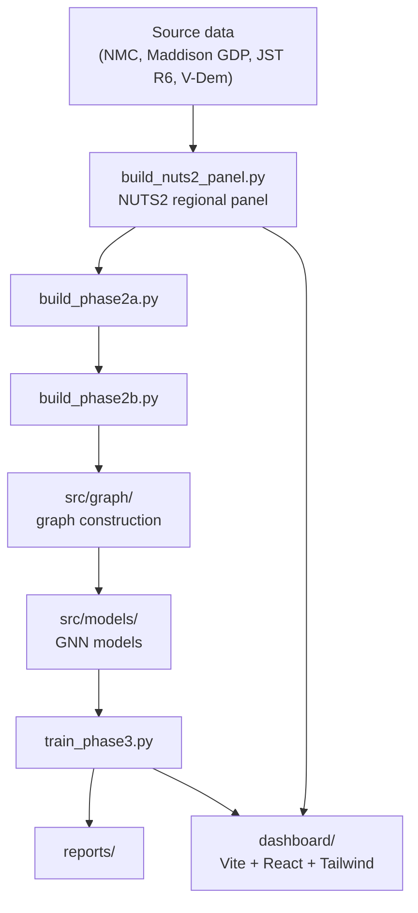

# EU GNN Risk Monitor

A graph neural network pipeline for monitoring economic/political risk across EU NUTS2 regions, built on a harmonized regional panel and a country-code bridge table (COW `stateabb` as canonical identifier).

## Status

Phase 1 (Data Foundation) is complete: regional panel construction, source ingestion (NMC v7, Maddison GDP, JST R6 loans/investment), and country code harmonization are in place. Phase 2/3 build out graph construction and GNN training.

## Architecture



## Pipeline stages

| Stage | Script | Purpose |
|---|---|---|
| Panel build | `build_nuts2_panel.py` | Constructs the harmonized NUTS2 regional panel |
| Phase 2a | `build_phase2a.py` | Intermediate feature/graph build step |
| Phase 2b | `build_phase2b.py` | Second intermediate build step |
| Training | `train_phase3.py` | GNN model training |

## Dashboard

`dashboard/` is a Vite + React + TypeScript + Tailwind app for visualizing regional risk output.

```bash
cd dashboard && npm install && npm run dev
```

## Environment

```bash
conda env create -f environment.yml
```

## Data

Raw/processed data conventions follow the standard project layout: `data/raw/` (immutable originals), `data/processed/` (pipeline outputs, gitignored), `data/external/` (gitignored).
